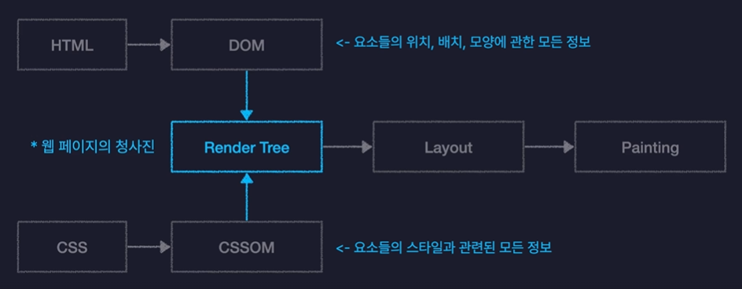

# React.js

### 📍 개요

- Meta(Facebook)이 개발한 오픈소스 JavaScript 라이브러리
- 웹 서비스의 복잡하고 동적인 사용자인터페이스(UI)를 효율적으로 개발하기 위해 만들어진 기술

### 📍 기술적인 특징

- 컴포넌트를 기반으로 UI를 표현한다
- 화면 업데이트 구현이 쉽다
- 화면 업데이트가 빠르게 처리된다

---

### 📍 컴포넌트를 기반으로 UI를 표현한다

- 컴포넌트 (Component)

  - 독립적이고 재사용 가능한 UI 구성 요소

- 웹 페이지 요소를 component 단위로 모듈화

  - 예시 : Header.js, Main.js, Footer.js
  - 여러 페이지에서 공통으로 사용되는 요소를 컴포넌트로 구현
  - 여러 개의 컴포넌트를 조립하여 웹페이지 표현
  - 중복 코드 제거, 해당 컴포넌트만 수정하여 유지보수 용이

### 📍 화면 업데이트 구현이 쉽다

- 업데이트

  - 사용자의 행동(클릭, 드래그)에 따라 웹 페이지가 스스로 모습을 바꿔 상호작용 하는 것

- 선언형 프로그래밍 방식으로 동작

  - 선언형 프로그래밍 : 과정은 생략하고 목적만 간결히 명시하는 방법 -> 코드가 간결함
  - 명령형 프로그래밍 : 목적을 이루기 위한 모든 일련의 과정을 설명하는 방식 -> 코드가 길고 복잡함

- State

  - 각 컴포넌트의 상태를 저장하는 변수
  - 값에 따라서 컴포넌트가 다른 UI를 화면에 렌더링하도록 설정

### 📍 화면 업데이트가 빠르게 처리된다

- 브라우저 렌더링 과정 (Critical Rendering Path)
  

  - DOM (Document Object Model) : HTML 문서를 객체로 변환한 모델
  - Render Tree : 화면에 렌더링 되어야 하는 요소의들 모든 정보 포함
  - Layout : 요소의 배치를 잡는 작업
  - Painting : 실제로 화면에 그려내는 과정

- JavaScript가 DOM을 수정하면 업데이트가 발생
  
  
  

  - Virtual Dom : DOM을 자바스크립트 객체로 흉내낸 것, 실제 DOM의 가벼운 복사본
  - React는 업데이트가 발생하면 실제 DOM을 수정하기 전에 가상의 DOM에 먼저 반영
  - 실제 DOM에는 필요한 최소한의 변경만 반영해 성능 향상

---

### 📍 React App 생성

- 방법 1.

  1. Node.js 패키지 생성
  2. React 라이브러리 설치
  3. 기타 도구 설치 및 설정

- 방법 2. Vite

  - 차세대 프론트엔드 개발 툴
  - 기본 설정이 적용된 React App 생성 가능
  - React 공식 문서에서도 권장하고 있음
  - `npm create vite@latest`

### 📍 React App 구동

- Vite를 통해 생성한 React App에는 웹 서버가 내장

- `npm run dev` : React App 서버를 가동시키는 명령어

  - http://localhost:5173/ : 현재 가동 중인 리액트 웹 서버에 접속할 수 있는 주소

  - 포트 번호 (Port Number) : 하나의 컴퓨터 내에서 여러 개의 서버를 동작시키기 위해서 필요한 주소 체계

- 웹 브라우저에서 주소로 접속 = 내컴퓨터(localhost)에서 실행되고 있는 리액트 웹 서버에 접속 요청

  - React App은 index.html 파일을 브라우저에게 응답

### 📍 React App 렌더링

1. Vite로 생성된 React App을 웹 브라우저에서 실행할 때 진입점인 index.html 파일이 가장 먼저 로드

2. index.html에서 script 태그로 연결된 main.jsx 자바스크립트 파일을 실행

3. main.jsx에서 App.jsx 파일의 App 함수가 리턴하는 HTML 요소를 React의 root 아래에 render 메서드를 통해서 화면에 렌더링

- 브라우저는 웹 페이지 로딩 시 기본적으로 HTML 파일을 읽음

- 리액트에서 HTML 태그를 리턴하는 함수를 '컴포넌트'라고 부름 (ex. App 컴포넌트)
